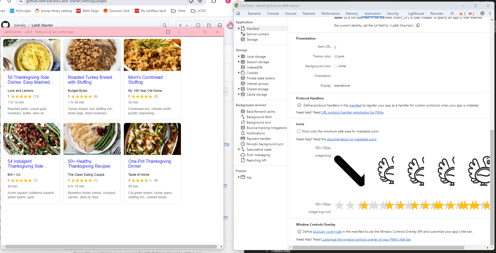

# Lab8-Starter

Service Workers can be provided where possible to achieve graceful degradation. At max technology, we have a full application with a strong internet connection, fast network speeds, and high network availability. However, if a user has slow internet or no internet connection, then the service workers serve as an alternative "backup" that stores the responses to internet calls locally in your browser before requesting the same data. This ensures that network requests are handled separately and offline the network. Service workers achieve graceful degredation because they provide a degraded user experience that is not as good as the max technology, but still delivers the essential functionality despite network connection issues.

[GitHub Pages](https://kieraliz.github.io/Lab8-Starter/)

The site prior to deploying on GitHub Pages...  

The site in incognito prior to deploying on GitHub Pages...  

The application prior to deploying on GitHub Pages...  

The final application after deploying on GitHub Pages...  

